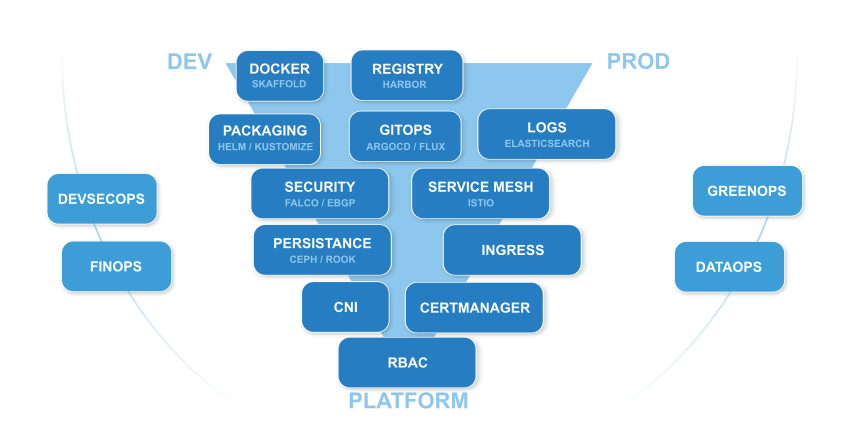

## A propos de moi / nous

- Developpeurs 
- Administrateurs Système
- Ingénieurs Devops : Ansible / Docker / Kubernetes / Gitlab CI) / Sécurité 
- Formateurs DevOps, Linux, Python, Sécurité
- Mais aussi graphistes, musiciens, philosophes de la technique, hackers :)

## A propos de vous

- Parcours ?
- Attentes ?

---

## Une formation ...

## ... DevOps ...

## ... en Runs 

