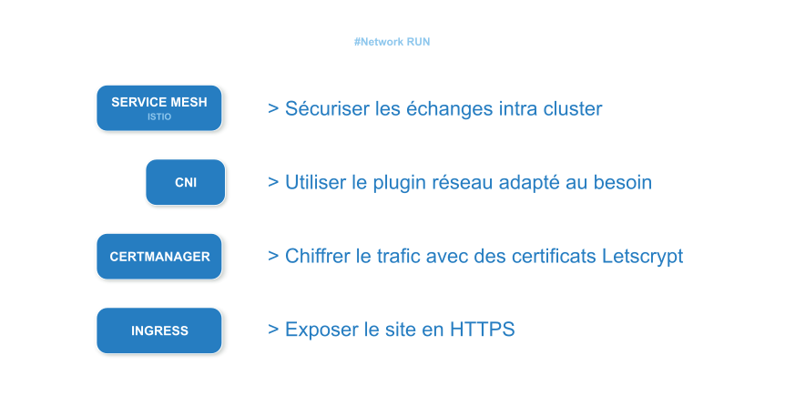
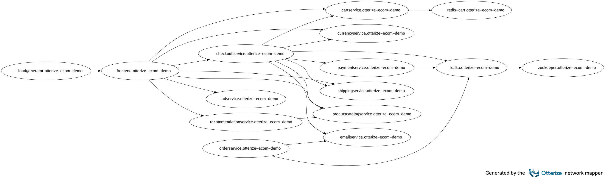

## Objectifs du Run

**Notre objectif sera de déployer des composants réseau avancées dans un cluster Kubernetes.**

## Outils 

**La connaissance et l'utilisation d'outils dédiés est essentielle pour opérer dans des environnements complexes commme Kubernetes.**

Une liste intéressante des outils disponibles dans Kubernetes, toujours plus nombreux : 

https://collabnix.github.io/kubetools

--- 

### [NetworkMapper](https://github.com/otterize/network-mapper) 

**Service persistant du cluster qui agit avec des watchers et fournit des extractions sous forme de graphe sans nécessiter de composant spécifique, bien que les fonctionnalités avancées aujourd'hui observent Kafka et IstIO.** 

---

### [Retina](https://retina.sh/) 

**Un service persistant du cluster (DaemonSet) qui offre plusieurs capacités**

- export de metrics 
- capture de trafic sur plusieurs pods en simultané

---

### Outils génériques

- **K8S Dashboard** ou autres dashboards de cloud providers
- **ArgoCD** ou autres plateformes GitOps comme DevTron, Kubesphere, ou d'autres
- **Weave Scope** prometteur mais weave a fait faillite
- **K9S** qui fournit une interface avancée en shell

**Dans l'ensemble il n'existe pas de solution parfaite.** 

Cela provient notamment du fait que les [metriques natives de Kubernetes](https://kubernetes.io/docs/reference/instrumentation/metrics/) sont pauvres en informations réseau.