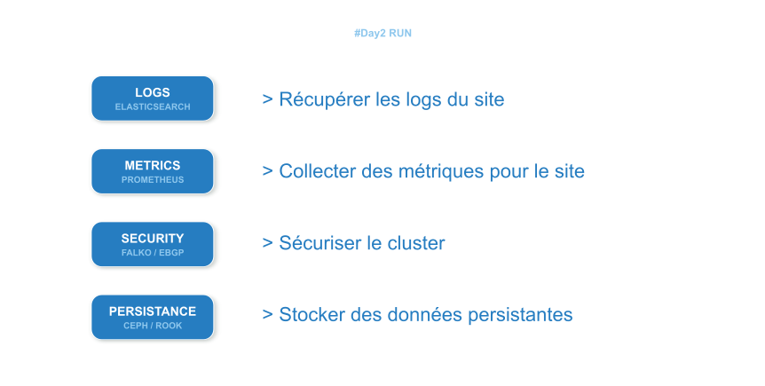

## Objectifs du Run

**L'objectif du run est d'ajouter à notre cluster Kubernetes des composants pour améliorer sa qualité.**

--- 

## Logique "Day 2" dans Kubernetes

**La logique "Day 2" dans Kubernetes fait référence aux opérations et maintenances nécessaires après le déploiement initial d'une application.**

Alors que le "Day 1" concerne principalement le déploiement et la configuration de base, le "Day 2" se concentre sur la gestion continue, l'optimisation et l'amélioration des applications en production.

Cela inclut les mises à jour, les corrections de bugs, la mise à l'échelle, ainsi que la surveillance et la gestion des performances.

--- 

### Enjeux du "Day 2"

**Les enjeux du "Day 2" sont cruciaux pour garantir la stabilité, la performance et la sécurité des applications en production.**

Une mauvaise gestion des opérations "Day 2" peut entraîner des interruptions de service, des performances dégradées et des vulnérabilités de sécurité.

Par conséquent, il est essentiel de disposer de processus robustes et d'outils adéquats pour gérer ces aspects de manière efficace.

---

### Importance des logs, métriques, sécurité et persistance

**Les logs et les métriques sont des éléments clés de la gestion "Day 2".**

Les logs fournissent des informations détaillées sur le fonctionnement des applications, facilitant le diagnostic des problèmes et l'analyse des incidents.

Les métriques, quant à elles, permettent de surveiller la performance des applications et des infrastructures, aidant à détecter les anomalies et à prendre des décisions informées pour l'optimisation.

---

**La sécurité est également un aspect critique, car les menaces évoluent constamment.**

Il est essentiel de mettre en place des mesures de sécurité proactives et réactives pour protéger les applications et les données.

---

**Enfin, la gestion de la persistance des données est indispensable pour garantir l'intégrité et la disponibilité des données critiques, surtout dans un environnement dynamique comme Kubernetes.**

--- 

### Illustration des enjeux du "Day 2"

| Aspect       | Description                                                                                     | Enjeux principaux                                           |
|--------------|-------------------------------------------------------------------------------------------------|-------------------------------------------------------------|
| Logs         | Enregistre les événements et les erreurs des applications                                       | Diagnostic des problèmes, analyse des incidents             |
| Métriques    | Surveille la performance des applications et des infrastructures                                | Détection des anomalies, optimisation des ressources        |
| Sécurité     | Protège les applications et les données contre les menaces                                      | Prévention des vulnérabilités, réaction rapide aux incidents |
| Persistance  | Assure la gestion et l'intégrité des données dans un environnement dynamique                    | Disponibilité des données, intégrité des informations       |
