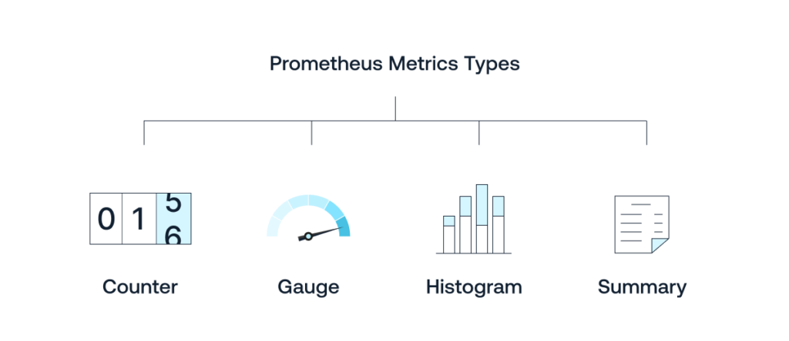

## Outils 

```shell

$ kubectl top 

```

--- 

## Historique de la collecte des métriques dans les systèmes distribués

**L'évolution de la collecte des métriques, des premiers outils SNMP aux solutions modernes comme Prometheus et Kubernetes, a considérablement amélioré l'automatisation et la flexibilité.**

Les API pour la découverte, la collecte et l'affichage des métriques ont permis une gestion plus efficace des systèmes distribués, facilitant ainsi la surveillance proactive et la résolution rapide des problèmes de performance.

---

### 1. Années 1990 : SNMP (Simple Network Management Protocol)

**Le protocole SNMP est standardisé et largement adopté pour la gestion des réseaux et la collecte des métriques des équipements réseau.**

Introduction de la collecte centralisée de métriques réseau via des agents SNMP sur les équipements.

Cela permet une gestion basique des performances et des états des équipements réseau.

---

### 2. Années 2000 : Nagios, Cacti et Munin

**Les outils comme Nagios, Cacti et Munin émergent pour la surveillance des serveurs et des infrastructures.**

Automatisation de la collecte des métriques de santé et de performance des serveurs.

Ces outils utilisent des plugins et des sondes pour recueillir des données de manière périodique, avec des interfaces web pour l'affichage des métriques.

Munin, en particulier, se distingue par sa simplicité d'installation, ses capacités de graphing pour visualiser les données de performance à long terme, et son utilisation d'une base de données RRD (Round-Robin Database) pour stocker les métriques de manière efficace et compacte.

---

### 3. 2012 : Collectd et Graphite

**Lancement de Collectd, un démon pour collecter et stocker des statistiques de performance, et Graphite, un outil de stockage et de visualisation de métriques.**

Collectd automatise la collecte des métriques système et applicatives via des plugins, tandis que Graphite fournit une API pour le stockage et la visualisation des données collectées.

Cette combinaison permet une intégration plus facile et des visualisations personnalisées.

---

### 4. 2015 : Prometheus

**Lancement de Prometheus par SoundCloud, rapidement adopté par la communauté open source.**

Prometheus introduit une nouvelle approche de la collecte des métriques avec une architecture de scraping pull-based, des labels pour la dimensionnalité des métriques, et une puissante API de requête (PromQL).

Il facilite la découverte automatique des cibles à surveiller via des annotations et des labels Kubernetes, améliorant l'automatisation et la flexibilité.

---

### 5. 2018 : Kubernetes et Prometheus Operator

**Introduction du Prometheus Operator pour Kubernetes.**

Le Prometheus Operator simplifie le déploiement, la gestion et la configuration de Prometheus dans les clusters Kubernetes.

Il utilise des Custom Resource Definitions (CRDs) pour automatiser la découverte des services, la configuration de scraping, et l'intégration avec Grafana pour la visualisation.

Cela permet une collecte et une visualisation des métriques hautement automatisées et adaptées aux environnements dynamiques de microservices.

---

## La métrologie et les métriques

### Définition de la métrologie

**La métrologie concerne la collecte, l'analyse et l'interprétation des données de performance et de fonctionnement des systèmes et applications.**

Elle vise à fournir des informations précises et fiables pour surveiller, gérer et optimiser les infrastructures IT.

### Définition d'une métrique

**Une métrique est une mesure quantifiable utilisée pour suivre et évaluer l'état, la performance ou la qualité d'un système ou d'un processus.**

Les métriques peuvent inclure des mesures telles que l'utilisation du CPU, la mémoire, les temps de réponse, les taux d'erreur, et bien d'autres.

---
## Types de métriques



- **Compteurs (Counters)** : Mesurent le cumul d'événements au fil du temps.

Ils ne diminuent jamais et sont utilisés pour des métriques comme le nombre de requêtes, les erreurs, etc.

Exemple : nombre total de requêtes HTTP.

- **Jauges (Gauges)** : Mesurent une valeur à un instant donné.

Elles peuvent augmenter et diminuer en fonction des conditions du système.

Exemple : utilisation actuelle du CPU.

- **Histogrammes** : Mesurent la distribution de valeurs sur des intervalles de temps, souvent utilisés pour des métriques de latence ou de taille de requêtes.

Ils incluent des buckets de compteurs cumulatifs, le nombre d'éléments présents dans l'histogramme, et la somme de leurs valeurs.

- **Sommes** : Fournissent un total cumulé de valeurs sur une période de temps spécifique.

Version évoluée des histogrammes offrant des dérivées des données présentes.

--- 

## Difficultés liées à la métrologie pour la surveillance des systèmes

### Impact de la collecte sur les ressources

**La collecte des métriques consomme des ressources système (CPU, mémoire, réseau).**

Une collecte trop fréquente ou sur un trop grand nombre de métriques peut affecter les performances du système surveillé.

--- 

### Prédictivité des saturations
**Il est difficile de prédire avec précision les saturations des ressources basées uniquement sur les métriques historiques.**

Les modèles de trafic et d'utilisation peuvent changer, rendant les prédictions incertaines.

Par exemple, la saturation de l'espace disque : être à 90% n'est pas forcément critique (le volume peut être stable voire Read Only), occuper 10% en 5 minutes peut être normal (ETL régulier et maîtrisé), mais 5% de plus par heure peut être fatal en quelques heures.


--- 

### Collecte durant les outages

**Collecter des métriques pendant des pannes ou des outages est un défi.**

Les outils de collecte peuvent eux-mêmes être affectés par l'outage, rendant difficile l'obtention de données complètes et précises sur les causes et les effets de la panne.

---

### Consistance des données
**Assurer la consistance des données collectées sur des systèmes distribués peut être difficile.**

Les différences de latence, les pertes de données et les désynchronisations peuvent affecter l'exactitude des métriques.

---

### Volume et complexité des données
**Le volume de données collectées peut être immense, nécessitant des outils robustes pour le stockage, le traitement et l'analyse.**

Gérer et interpréter ces données peut devenir complexe, surtout dans des environnements à grande échelle avec des milliers de métriques.

---

### Sécurité et confidentialité
**La collecte de métriques peut parfois impliquer des données sensibles ou critiques.**

Assurer la sécurité et la confidentialité des données collectées est primordial pour éviter les fuites d'informations et les intrusions.

---

## Vue d'ensemble des composants de collecte des métriques

| Description                           | Fourni par               | Type de métriques               | Utilisation                                     |
|---------------------------------------|--------------------------|---------------------------------|-------------------------------------------------|
| Metrics Server                        | Kubernetes               | CPU, Mémoire                    | Autoscaling (HPA, VPA)                          |
| Node Exporter                         | Prometheus               | CPU, Mémoire, Disque, Réseau    | Surveillance détaillée, alerting, dashboards    |
| Applications instrumentées            | Prometheus Client Lib    | Requêtes, Temps de réponse, Erreurs, Métier | Surveillance des performances et de la santé |
| Services mesh (Istio, Linkerd)        | Istio, Linkerd           | Trafic, Latence, Taux de succès | Surveillance des communications inter-services  |
| Ingress                               | Ingress Controller | Requêtes HTTP, Latence, Erreurs | Surveillance des performances et de la santé    |

Ce tableau résume les différents composants impliqués dans la collecte des métriques dans un cluster Kubernetes, les types de métriques collectées, et les usages correspondants.

--- 

## Fonctionnement de Prometheus

**Prometheus est un système de surveillance et d'alerte open-source conçu pour collecter des métriques et des événements en temps réel.**

Doc:
- Github : https://github.com/prometheus
- Documentation: https://prometheus.io/docs/introduction/overview/
---

### PULL, HTTP, timeseries

**Prometheus scrape (récupère) périodiquement les métriques de type Prometheus sur les endpoints HTTP des applications et des services qu'il surveille.**

  - **Pull** : va chercher les données sur les noeuds depuis le serveur
  - **HTTP** : utilise le protocole standard 
  - **Timeseries** : associe un timestamp avec des données nommées et labelisées  
---

### Utilisation de l'autoconfiguration dans Kubernetes

**Dans Kubernetes, Prometheus utilise l'autoconfiguration pour découvrir automatiquement les endpoints à surveiller en utilisant des labels et des annotations.**

1. **Service Discovery** : Prometheus utilise les mécanismes de découverte de service de Kubernetes pour trouver les cibles à scrapper.
Cela inclut la découverte des pods, des services, et des endpoints.
   
2. **Annotations pour la découverte des métriques** :
   - Les pods et les services peuvent être annotés pour indiquer à Prometheus qu'ils exposent des métriques et à quel endpoint les trouver.
   - Exemple d'annotations pour un pod :
     ```yaml
     metadata:
       annotations:
         prometheus.io/scrape: "true"
         prometheus.io/path: "/metrics"
         prometheus.io/port: "8080"
     ```

3. **Configuration de Prometheus** :
   - Un fichier de configuration `prometheus.yml` spécifie les règles de découverte des services et les cibles à scrapper.
   - Exemple de configuration pour Kubernetes :
     ```yaml
     global:
       scrape_interval: 15s
     scrape_configs:
       - job_name: 'kubernetes-pods'
         kubernetes_sd_configs:
           - role: pod
         relabel_configs:
           - source_labels: [__meta_kubernetes_pod_annotation_prometheus_io_scrape]
             action: keep
             regex: true
           - source_labels: [__meta_kubernetes_pod_annotation_prometheus_io_path]
             action: replace
             target_label: __metrics_path__
             regex: (.+)
           - source_labels: [__address__, __meta_kubernetes_pod_annotation_prometheus_io_port]
             action: replace
             target_label: __address__
             regex: (.+):(?:\d+);(\d+)
             replacement: ${1}:${2}
     ```

---

### Format du fichier de métriques exposé par Prometheus

Les métriques exposées par Prometheus doivent être dans un format textuel spécifique appelé **Prometheus exposition format**.

Les métriques sont généralement exposées sur un endpoint HTTP `/metrics` et suivent un format simple, avec des lignes de texte pour chaque métrique.

**Exemple de format de métriques :**

```plaintext
# HELP http_requests_total The total number of HTTP requests.
# TYPE http_requests_total counter
http_requests_total{method="post",code="200"} 1027
http_requests_total{method="post",code="400"} 3

# HELP http_request_duration_seconds The HTTP request latencies in seconds.
# TYPE http_request_duration_seconds histogram
http_request_duration_seconds_bucket{le="0.05"} 24054
http_request_duration_seconds_bucket{le="0.1"} 33444
http_request_duration_seconds_bucket{le="0.2"} 100392
http_request_duration_seconds_bucket{le="0.5"} 129389
http_request_duration_seconds_bucket{le="1"} 133988
http_request_duration_seconds_bucket{le="+Inf"} 144320
http_request_duration_seconds_sum 53423
http_request_duration_seconds_count 144320

# HELP memory_usage_bytes Memory usage in bytes.
# TYPE memory_usage_bytes gauge
memory_usage_bytes{instance="localhost"} 38482900
```

- **HELP** : Une ligne d'aide optionnelle décrivant la métrique.
- **TYPE** : Le type de la métrique (counter, gauge, histogram, summary).
- **Métrique** : La métrique elle-même, avec des labels optionnels et une valeur.

---

## Exposer les métriques de son application

**Voici un exemple simple montrant comment exposer le nombre d'utilisateurs connectés sur les 1, 5, 15 et 60 dernières minutes dans une application python.**

---

### Étape 1 : Installer la bibliothèque prometheus_client
Assurez-vous que la bibliothèque `prometheus_client` est installée.

Vous pouvez l'installer via pip :

```sh
pip install prometheus_client
```
---

### Étape 2 : Exemple de code Python pour exposer les métriques

```python
from prometheus_client import start_http_server, Gauge
import random
import time

# Créer des métriques de type Gauge pour le nombre d'utilisateurs connectés
CONNECTED_USERS_1M = Gauge('connected_users_1m', 'Number of users connected in the last 1 minute')
CONNECTED_USERS_5M = Gauge('connected_users_5m', 'Number of users connected in the last 5 minutes')
CONNECTED_USERS_15M = Gauge('connected_users_15m', 'Number of users connected in the last 15 minutes')
CONNECTED_USERS_60M = Gauge('connected_users_60m', 'Number of users connected in the last 60 minutes')

def collect_metrics():
    # Simuler la collecte de métriques pour les utilisateurs connectés
    users_1m = random.randint(50, 100)  # Simuler des valeurs aléatoires
    users_5m = random.randint(200, 300)
    users_15m = random.randint(500, 700)
    users_60m = random.randint(1000, 1500)

    # Mettre à jour les valeurs des métriques
    CONNECTED_USERS_1M.set(users_1m)
    CONNECTED_USERS_5M.set(users_5m)
    CONNECTED_USERS_15M.set(users_15m)
    CONNECTED_USERS_60M.set(users_60m)

if __name__ == '__main__':
    # Démarrer le serveur HTTP pour exposer les métriques
    start_http_server(8000)
    print("Prometheus metrics available at http://localhost:8000/metrics")

    # Collecter les métriques toutes les 5 secondes
    while True:
        collect_metrics()
        time.sleep(5)
```

--- 

### Exemple de sortie des métriques

Accéder à `http://localhost:8000/metrics` afficherait des métriques similaires à ceci :

```
# HELP connected_users_1m Number of users connected in the last 1 minute
# TYPE connected_users_1m gauge
connected_users_1m 72.0

# HELP connected_users_5m Number of users connected in the last 5 minutes
# TYPE connected_users_5m gauge
connected_users_5m 250.0

# HELP connected_users_15m Number of users connected in the last 15 minutes
# TYPE connected_users_15m gauge
connected_users_15m 635.0

# HELP connected_users_60m Number of users connected in the last 60 minutes
# TYPE connected_users_60m gauge
connected_users_60m 1284.0
```

---

## Les Time Series Databases (TSDB)

**Face à la nécessité croissante de gérer et d'analyser efficacement des volumes massifs de données générées en continu par des capteurs, des applications et des infrastructures informatiques, une solution technique spécifique a émergé.**

Contrairement aux bases de données traditionnelles, les TSDB sont spécialement optimisées pour stocker, indexer et interroger des données chronologiques avec précision et rapidité.

---

### Spécificités 

1. **Optimisation pour l'insertion rapide** : TSDB sont conçues pour gérer de nombreux inserts par seconde, car les données de séries temporelles sont souvent générées en continu et à grande vitesse.
2. **Compression des données** : Pour gérer efficacement de grandes quantités de données, les TSDB utilisent des techniques de compression pour réduire la taille des données stockées.
3. **Indexation temporelle** : Les TSDB indexent les données par timestamp pour permettre des requêtes rapides et efficaces sur les périodes de temps.
4. **Gestion de la rétention des données** : Les TSDB offrent des politiques de rétention pour supprimer automatiquement les anciennes données, aidant à gérer la taille de la base de données.
5. **Aggregation et downsampling** : Les TSDB fournissent des fonctionnalités pour agréger et réduire la résolution des données (downsampling), permettant des analyses à différents niveaux de granularité.

--- 

### Solutions de Time Series Databases

Pour une liste complète (+50 références...) : https://github.com/xephonhq/awesome-time-series-database

| Nom              | Modèle économique         | Durée de rétention des données   | Facteurs distinctifs                 |
|------------------|---------------------------|----------------------------------|--------------------------------------|
| InfluxDB         | Open-source et commercial | Configurable (heures à années)   | SQL-like query language (Flux), haute écriture et compression des données |
| Prometheus       | Open-source               | Configurable (généralement court terme) | Intégration native avec Kubernetes, modèle de scrape pull |
| TimescaleDB      | Open-source et commercial | Configurable (heures à années)   | Extension PostgreSQL, SQL standard, scale-out via hypertables |
| OpenTSDB         | Open-source               | Illimitée (selon la configuration HBase) | Évolutivité horizontale via HBase, intégration avec Hadoop |
| AWS Timestream   | Commercial                | Automatique (gestion par AWS)    | Service géré par AWS, intégration avec d'autres services AWS, tarification à l'utilisation |
| Azure Data Explorer (Kusto) | Commercial   | Configurable                    | Service géré par Azure, support de requêtes ad-hoc et analyses complexes |

--- 

## PromQL : Un langage spécifique pour requêter les métriques Prometheus

**PromQL** (Prometheus Query Language) est un langage de requête puissant et flexible spécialement conçu pour interroger les métriques stockées dans Prometheus.

Il permet aux utilisateurs de récupérer, manipuler et visualiser des données de séries temporelles collectées par Prometheus, offrant des capacités avancées pour l'analyse et la surveillance.

---
### Exemple de requêtes PromQL

1. **Sélection de base**
   ```promql
   http_requests_total
   ```
   Sélectionne toutes les séries temporelles avec le nom de métrique `http_requests_total`.

--- 

2. **Sélection avec labels**
   ```promql
   http_requests_total{job="api-server", status="200"}
   ```
   Sélectionne les séries temporelles avec le nom de métrique `http_requests_total` et les labels `job` et `status` spécifiques.

--- 

3. **Agrégation**
   ```promql
   sum(rate(http_requests_total[5m])) by (job)
   ```
   Calcule le taux de requêtes HTTP total par job sur les 5 dernières minutes, puis somme les résultats par label `job`.

--- 

4. **Opérations arithmétiques**
   ```promql
   node_memory_MemAvailable_bytes / node_memory_MemTotal_bytes * 100
   ```
   Calcule le pourcentage de mémoire disponible par rapport à la mémoire totale pour chaque nœud.

--- 

5. **Fonctions de traitement des données**
   ```promql
   rate(http_requests_total[1m])
   ```
   Calcule le taux de requêtes HTTP par seconde sur la dernière minute.

--- 

### Utilisation dans les tableaux de bord et alertes

**PromQL est couramment utilisé dans les tableaux de bord de surveillance (comme Grafana) pour visualiser les métriques en temps réel.**

Il est également utilisé dans les règles d'alerte de Prometheus pour déclencher des alertes basées sur des conditions spécifiques des métriques.

En résumé, PromQL est un outil essentiel pour exploiter pleinement les capacités de Prometheus, permettant une surveillance fine et une analyse détaillée des métriques de séries temporelles.


--- 

## Comparaison des interfaces d'accès aux métriques

| Aspect                   | Grafana                                           | Kibana                                             | Chronograf                             |
|--------------------------|---------------------------------------------------|----------------------------------------------------|-----------------------------------------------------|
| **Description**          | Plateforme de surveillance et de visualisation des données de séries temporelles | Plateforme de visualisation et d'analyse des données, principalement utilisée avec Elasticsearch | Outil spécialisé dans la visualisation des métriques  |
| **Support multi-source** | Oui, supporte Prometheus, InfluxDB, Graphite, Elasticsearch, et plus encore | Principalement Elasticsearch, peut intégrer des sources via Logstash ou Beats | Principalement InfluxDB |
| **Tableaux de bord**     | Interactifs, avec des widgets avancés et des annotations | Variés, avec des graphiques, des cartes, des diagrammes à secteurs | Graphiques interactifs  |
| **Alerting**             | Avancé, avec des alertes basées sur des conditions complexes | Intégré, principalement pour les données Elasticsearch | Capacité d'alerting de base  |
| **Extensibilité**        | Écosystème riche de plugins pour nouvelles sources et visualisations | Plugins disponibles, mais principalement orientés Elasticsearch | Extensions limitées, focalisé sur InfluxDB |
| **Utilisation**          | Surveillance des performances, visualisation des métriques, création de tableaux de bord personnalisés | Analyse des logs et des données indexées, visualisations variées | Surveillance et visualisation des métriques  |

--- 

## TP : Collecte automatisée de métriques dans Kubernetes

### Objectif
Expérimenter la collecte automatisée de métriques dans Kubernetes en utilisant Prometheus et Grafana pour visualiser les métriques d'un pod NGINX.

### Prérequis
- Un cluster Kubernetes fonctionnel
- Accès administrateur au cluster
- kubectl installé et configuré

### Étape 1 : Déploiement d'un pod NGINX

1. Créez un fichier YAML pour le déploiement d'un pod NGINX (nginx-deployment.yaml) :

```yaml
apiVersion: apps/v1
kind: Deployment
metadata:
  name: nginx-deployment
spec:
  replicas: 1
  selector:
    matchLabels:
      app: nginx
  template:
    metadata:
      labels:
        app: nginx
      annotations:
        prometheus.io/scrape: "true"
        prometheus.io/path: "/metrics"
        prometheus.io/port: "80"
    spec:
      containers:
      - name: nginx
        image: nginx
        ports:
        - containerPort: 80
```

2. Appliquez le fichier pour déployer NGINX :

```sh
kubectl apply -f nginx-deployment.yaml
```

### Étape 2 : Déploiement de Prometheus en tant qu'Operator

Pour simplifier la gestion et l'intégration avec Kubernetes, nous allons déployer Prometheus en utilisant le Prometheus Operator.

1. Installez le Prometheus Operator :

```sh
kubectl create namespace monitoring
kubectl apply -f https://raw.githubusercontent.com/prometheus-operator/prometheus-operator/main/bundle.yaml -n monitoring
```

2. Créez un ServiceMonitor pour scrapper les métriques du pod NGINX. Créez un fichier `nginx-servicemonitor.yaml` :

```yaml
apiVersion: monitoring.coreos.com/v1
kind: ServiceMonitor
metadata:
  name: nginx-servicemonitor
  namespace: monitoring
  labels:
    release: prometheus-operator
spec:
  selector:
    matchLabels:
      app: nginx
  endpoints:
  - port: web
    interval: 15s
    path: /metrics
```

3. Appliquez le ServiceMonitor :

```sh
kubectl apply -f nginx-servicemonitor.yaml
```

4. Créez une instance de Prometheus pour surveiller les ressources Kubernetes. Créez un fichier `prometheus-instance.yaml` :

```yaml
apiVersion: monitoring.coreos.com/v1
kind: Prometheus
metadata:
  name: prometheus
  namespace: monitoring
spec:
  serviceMonitorSelector:
    matchLabels:
      release: prometheus-operator
  resources:
    requests:
      memory: 400Mi
```

5. Appliquez le fichier pour déployer Prometheus :

```sh
kubectl apply -f prometheus-instance.yaml
```

### Étape 3 : Déploiement de Grafana

1. Créez un fichier YAML pour le déploiement de Grafana (grafana-deployment.yaml) :

```yaml
apiVersion: v1
kind: Service
metadata:
  name: grafana
  namespace: monitoring
spec:
  type: LoadBalancer
  ports:
  - port: 3000
    targetPort: 3000
  selector:
    app: grafana
---
apiVersion: apps/v1
kind: Deployment
metadata:
  name: grafana
  namespace: monitoring
spec:
  replicas: 1
  selector:
    matchLabels:
      app: grafana
  template:
    metadata:
      labels:
        app: grafana
    spec:
      containers:
      - name: grafana
        image: grafana/grafana
        ports:
        - containerPort: 3000
        env:
        - name: GF_SECURITY_ADMIN_PASSWORD
          value: admin
```

2. Appliquez le fichier pour déployer Grafana :

```sh
kubectl apply -f grafana-deployment.yaml
```

3. Configurez Grafana pour utiliser Prometheus comme source de données :
   - Accédez à l'interface web de Grafana.
   - Ajoutez Prometheus comme source de données (URL : `http://prometheus.monitoring.svc.cluster.local:9090`).

### Étape 4 : Création d'un tableau de bord Grafana

1. Accédez à l'interface de Grafana et créez un nouveau tableau de bord.
2. Ajoutez un nouveau panneau (panel) pour visualiser les métriques de NGINX :
   - Utilisez la requête PromQL : `rate(http_requests_total[5m])`
   - Configurez le panneau pour afficher les résultats de manière graphique.

### Étape 5 : Vérification de la configuration

1. Accédez à Prometheus pour vérifier que les métriques du pod NGINX sont bien collectées.
   - URL : `http://prometheus.monitoring.svc.cluster.local:9090`
   - Utilisez PromQL pour vérifier les métriques : `up{job="nginx"}`

2. Vérifiez que les métriques sont bien affichées dans Grafana.
   - URL : `http://<Grafana-LoadBalancer-IP>:3000`

## Conclusion

Ce TP vous permet de déployer et de configurer Prometheus et Grafana pour la collecte et la visualisation des métriques d'un pod NGINX dans un cluster Kubernetes. Vous aurez appris à utiliser des annotations pour l'autoconfiguration, à déployer Prometheus en tant qu'Operator, et à configurer Grafana pour visualiser les données collectées.