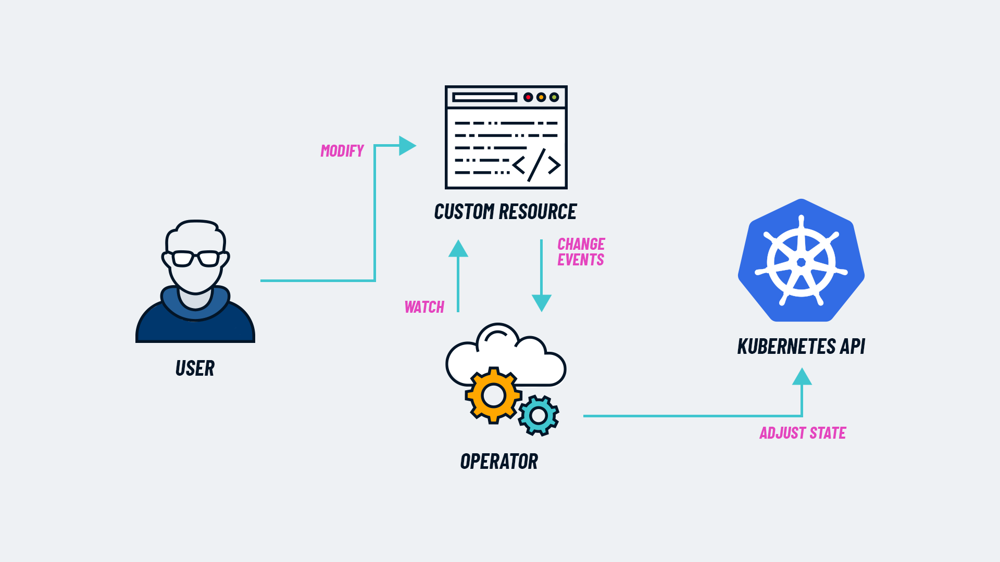

## Quick Start avec Kubebuilder

### Prérequis
* Go v1.20+
* Docker v17.03+
* Kubectl v1.11.3+
* Accès à un cluster Kubernetes v1.11.3+

### Opération 1 : Installer Kubebuilder
```bash
curl -L -o kubebuilder "https://go.kubebuilder.io/dl/latest/$(go env GOOS)/$(go env GOARCH)"
chmod +x kubebuilder && mv kubebuilder /usr/local/bin/
```

### Opération 2 : Créer un projet
```bash
mkdir -p ~/projects/guestbook
cd ~/projects/guestbook
kubebuilder init --domain my.domain --repo my.domain/guestbook
```

### Opération 3 : Créer une API
```bash
kubebuilder create api --group webapp --version v1 --kind Guestbook
```

## Optionnel : Ajouter le code custom

**Si vous appuyez sur "y" pour "Create Resource [y/n]" et "Create Controller [y/n]", cela créera les fichiers `api/v1/guestbook_types.go`, où l'API est définie, et `internal/controllers/guestbook_controller.go`, où la logique métier de réconciliation est implémentée pour ce type (CRD).**

```go
// api/v1/guestbook_types.go

// GuestbookSpec defines the desired state of Guestbook
type GuestbookSpec struct {
    // INSERT ADDITIONAL SPEC FIELDS - desired state of cluster
    // Important: Run "make" to regenerate code after modifying this file

    // Quantity of instances
    // +kubebuilder:validation:Minimum=1
    // +kubebuilder:validation:Maximum=10
    Size int32 `json:"size"`

    // Name of the ConfigMap for GuestbookSpec's configuration
    // +kubebuilder:validation:MaxLength=15
    // +kubebuilder:validation:MinLength=1
    ConfigMapName string `json:"configMapName"`

    // +kubebuilder:validation:Enum=Phone;Address;Name
    Type string `json:"alias,omitempty"`
}

// GuestbookStatus defines the observed state of Guestbook
type GuestbookStatus struct {
    // INSERT ADDITIONAL STATUS FIELD - define observed state of cluster
    // Important: Run "make" to regenerate code after modifying this file

    // PodName of the active Guestbook node.
    Active string `json:"active"`

    // PodNames of the standby Guestbook nodes.
    Standby []string `json:"standby"`
}

// +kubebuilder:object:root=true
// +kubebuilder:subresource:status
// +kubebuilder:resource:scope=Cluster

// Guestbook is the Schema for the guestbooks API
type Guestbook struct {
    metav1.TypeMeta   `json:",inline"`
    metav1.ObjectMeta `json:"metadata,omitempty"`

    Spec   GuestbookSpec   `json:"spec,omitempty"`
    Status GuestbookStatus `json:"status,omitempty"`
}
```

```sh
make manifests
```

### Opération 4 : Installer les CRDs
```bash
make install
```

### Opération 5 : Lancer le contrôleur
```bash
make run
```

### Optionnel : Installer des Instances de Ressources Personnalisées

Si vous avez appuyé sur "y" pour "Create Resource [y/n]", vous avez créé un CR pour votre CRD dans vos exemples (assurez-vous de les modifier d'abord si vous avez changé la définition de l'API) :

```bash
kubectl apply -k config/samples/
```

### Opération 6 : Déployer sur le cluster
```bash
make docker-build docker-push IMG=<some-registry>/<project-name>:tag
make deploy IMG=<some-registry>/<project-name>:tag
```

### Désinstaller 

Pour supprimer vos CRDs du cluster :
```bash
make uninstall
```

Pour retirer le contrôleur du cluster :
```bash
make undeploy
```

Pour plus de détails, visitez [Kubebuilder Quick Start](https://book.kubebuilder.io/quick-start).

Il existe d'autres documentations intéressantes : 
- le Book Kubebuilder https://book.kubebuilder.io/introduction
- la doc officielle  sur les Controllers : https://kubernetes.io/docs/concepts/architecture/controller/

--- 

## Développement d'Operators Personnalisés

**Pour produire ses propres **Operators**, il est crucial de bien comprendre ce modèle d'extension de Kubernetes.**




- L'API Server expose les CRD, permettant aux utilisateurs de créer et de gérer des Custom Resources (CR).
- Le Controller surveille les CR pour détecter tout changement.
- La Reconcile Loop s'exécute en continu pour aligner l'état actuel de l'application avec l'état désiré spécifié dans les CR.
- L'Operator prend des actions telles que le déploiement, la mise à jour, la sauvegarde, et la récupération des ressources nécessaires selon les meilleures pratiques encapsulées dans sa logique opérationnelle.

---

**Liste d'outils pour écrire ses opérateurs.**

https://kubernetes.io/docs/concepts/extend-kubernetes/operator/#writing-operator

--- 

## Définitions 

### Les CRDs

**Les CRDs permettent de définir de nouveaux types de ressources qui vont être gérés par votre Operator.**


```yaml
# myresource-crd.yaml
apiVersion: apiextensions.k8s.io/v1
kind: CustomResourceDefinition
metadata:
  name: myresources.example.com
spec:
  group: example.com
  versions:
    - name: v1
      served: true
      storage: true
      schema:
        openAPIV3Schema:
          type: object
          properties:
            spec:
              type: object
              properties:
                name:
                  type: string
                drink:
                  type: string
                  format: int32
  scope: Namespaced
  # The conversion section is introduced in Kubernetes 1.13+ with a default value of
  # None conversion (strategy sub-field set to None).
  conversion:
    # None conversion assumes the same schema for all versions and only sets the apiVersion
    # field of custom resources to the proper value
    strategy: None  
  names:
    plural: drinks
    singular: drink
    kind: Drink
    shortNames:
    - dr
```


```sh
kubectl apply -f myresource-crd.yaml
```


```yaml
# myresource-instance.yaml
apiVersion: example.com/v1
kind: Drink
metadata:
  name: example-drink
spec:
  name: "my-drink"
  drink: "coffee"
```

```sh
kubectl apply -f myresource-instance.yaml
```

---

### Définir le type de données acceptées

Les types de données pour les champs des ressources sont définis dans le schéma OpenAPI v3 sous `spec.versions.schema.openAPIV3Schema`. Voici quelques types courants :

- **string** : pour les chaînes de caractères
- **integer** : pour les nombres entiers
- **number** : pour les nombres flottants
- **boolean** : pour les valeurs vrai/faux
- **array** : pour les listes d'éléments
- **object** : pour les objets JSON imbriqués

### Exemple de définition de type de données

```yaml
properties:
  spec:
    type: object
    properties:
      name:
        type: string
      replicas:
        type: integer
        format: int32
```

Ce schéma définit que le champ `name` doit être une chaîne de caractères et que le champ `replicas` doit être un entier de 32 bits.

---

**Des types de données avancés pour les CRDs incluent les adresses IP, les noms DNS, les adresses email, et les URIs, et peuvent être spécifiés avec des formats dans le schéma OpenAPI v3 (`format: "ipv4"`, `format: "ipv6"`, `format: "hostname"`, etc.).** 

Pour les connaître, consultez la [documentation officielle d'OpenAPI v3](https://swagger.io/specification/).

--- 

### Mon premier Operator

**Voici un aperçu des étapes pour créer un Operator qui génère une ConfigMap à partir d'un CRD.** 

L'installation est basée sur le tutoriel de https://codeburst.io/kubernetes-operators-by-example-99a77ea4ac43


---

**Installer go**

Disponible sur https://go.dev/dl/

--- 
**Installer make**

Le package est en principe disponible dans Debian / Ubuntu.

--- 
**Installer l'Operator SDK**

Disponible sur https://github.com/operator-framework/operator-sdk/releases/download/

**Initialiser un nouveau projet Operator**

```sh
operator-sdk init --domain example.com --repo github.com/example/myoperator
```

**Créer une nouvelle API**
```sh
operator-sdk create api --group example --version v1 --kind Drink --resource --controller
```

**Éditer `api/v1/drink_types.go` pour ajouter les champs du CRD**


```go
type DrinkSpec struct {
    Name  string `json:"name"`
    Drink string `json:"drink"`
}

type DrinkStatus struct {
    // Status fields here
}

// +kubebuilder:object:root=true
// +kubebuilder:subresource:status
type Drink struct {
    metav1.TypeMeta   `json:",inline"`
    metav1.ObjectMeta `json:"metadata,omitempty"`
    Spec              DrinkSpec   `json:"spec,omitempty"`
    Status            DrinkStatus `json:"status,omitempty"`
}

// +kubebuilder:object:root=true
type DrinkList struct {
    metav1.TypeMeta `json:",inline"`
    metav1.ListMeta `json:"metadata,omitempty"`
    Items           []Drink `json:"items"`
}

func init() {
    SchemeBuilder.Register(&Drink{}, &DrinkList{})
}
```

* **Éditer `controllers/drink_controller.go` pour créer une ConfigMap**
```go
func (r *DrinkReconciler) Reconcile(ctx context.Context, req ctrl.Request) (ctrl.Result, error) {
    log := r.Log.WithValues("drink", req.NamespacedName)

    // Fetch the Drink instance
    var drink examplev1.Drink
    if err := r.Get(ctx, req.NamespacedName, &drink); err != nil {
        log.Error(err, "unable to fetch Drink")
        return ctrl.Result{}, client.IgnoreNotFound(err)
    }

    // Define the ConfigMap
    cm := &corev1.ConfigMap{
        ObjectMeta: metav1.ObjectMeta{
            Name:      drink.Name,
            Namespace: drink.Namespace,
        },
        Data: map[string]string{
            "name":  drink.Spec.Name,
            "drink": drink.Spec.Drink,
        },
    }

    // Set Drink instance as the owner and controller
    if err := ctrl.SetControllerReference(&drink, cm, r.Scheme); err != nil {
        return ctrl.Result{}, err
    }

    // Create or Update the ConfigMap
    _, err := ctrl.CreateOrUpdate(ctx, r.Client, cm, func() error {
        cm.Data["name"] = drink.Spec.Name
        cm.Data["drink"] = drink.Spec.Drink
        return nil
    })

    if err != nil {
        return ctrl.Result{}, err
    }

    return ctrl.Result{}, nil
}
```
**Copier le CRD dans le projet**

On les met dans `config/crd/base`.


**Construire l'image Docker** :

   ```sh
   make docker-build IMG=<your-registry>/drink-operator:latest
   ```

**Pousser l'image Docker vers un registre** :
```sh
   make docker-push IMG=<your-registry>/drink-operator:latest
   ```

**Déployer l'Operator sur le cluster Kubernetes** :
   ```sh
   make deploy IMG=<your-registry>/drink-operator:latest
   ```

### Gestion des versions

#### Enjeux d'Évolution

**Votre operator va devoir évoluer rapidement en raison des pressions externes** 

- Corrections de bugs
- Novuelles Features
- Évolutions de l'API de Kubernetes

---

**Vous devez alors gérer des problèmes complexes** 

- **Compatibilité** : Assurer la compatibilité ascendante et descendante lors de l'évolution des APIs.
- **Migration** : Faciliter la migration des utilisateurs vers de nouvelles versions de CRD.

--- 

### Gestion des versions multiples d'un Operator

#### Modèles pour gérer plusieurs versions de CRD

1. **Ventilation par version**
   - Un contrôleur par version de CRD, chaque contrôleur gérant une version spécifique.
   - Simplifie la gestion des versions mais augmente la complexité de déploiement.

2. **Version unique**
   - Un seul contrôleur gérant toutes les versions des CRD.
   - Utilise des conditions pour déterminer la version et appliquer la logique appropriée.
```yaml
switch cr.APIVersion {
    case "example.com/v1alpha1":
        // Logic for v1alpha1
    case "example.com/v1beta1":
        // Logic for v1beta1
}
```
3. **Approche hybride**
   - Combinaison des deux modèles précédents.
   - Un contrôleur principal gère les versions stables et des contrôleurs supplémentaires pour les versions en développement.

#### Convertir les versions de CRD via des webhooks

**La conversion automatique via webhooks permet aux Operators de gérer les évolutions des APIs sans interrompre le fonctionnement des instances existantes.**

Ce pattern conversion est recommandée par la documentation de Kubernetes recommandé par Kubernetes dans [la documentation sur les versions de CRD](https://kubernetes.io/docs/tasks/extend-kubernetes/custom-resources/custom-resource-definition-versioning/).

---

**Lorsqu'une ressource personnalisée (CRD) évolue, un webhook de conversion est utilisé pour traduire les anciennes versions des objets en nouvelles versions et vice versa.**

Cela assure que les ressources créées avec des versions antérieures de l'API restent compatibles et fonctionnelles même après une mise à jour de l'Operator.

Les webhooks de conversion sont particulièrement utiles lors de la dépréciation de champs ou l'ajout de nouvelles fonctionnalités.

Ils permettent aux développeurs de gérer les transitions entre les versions de manière transparente, en maintenant une compatibilité ascendante et descendante.

---

**Les webhooks de conversion sont des serveurs d'un type particulier.** 

Voici [un exemple standard dans le code de Kubernetes](https://github.com/kubernetes/kubernetes/blob/v1.25.3/test/images/agnhost/crd-conversion-webhook/main.go).

Avec [son exemple de converter](https://github.com/kubernetes/kubernetes/blob/v1.25.3/test/images/agnhost/crd-conversion-webhook/converter/example_converter.go). 


---

## Dans le cluster, un Operator...

#### Ne s'exécute pas en tant que root
Les Operators ne doivent pas fonctionner avec des privilèges root pour des raisons de sécurité, mais utiliser un ServiceAccount dédié.

#### N'auto enregistre pas lui-même les CRDs
Les CRDs doivent être gérés séparément pour éviter des privilèges globaux dangereux et permettre une gestion versionnée.

#### N'installe pas d'autres Operators
L'installation d'autres Operators doit être gérée par le Operator Lifecycle Manager ([OLM](https://olm.operatorframework.io/)), pas par l'Operator lui-même.

#### S'appuie sur les dépendances via un gestionnaire de paquets (OLM)
Utiliser OLM pour gérer les dépendances assure une gestion cohérente et fiable.

#### Écrit des informations de statut significatives sur les objets Custom Resources
Les Operators doivent fournir des statuts détaillés pour les Custom Resources, sauf s'ils sont utilisés uniquement pour stocker des données structurées.

#### Capable de mettre à jour à partir d'une version précédente de l'Operator
Les Operators doivent permettre des mises à jour sans interruption depuis une version précédente.

#### Capable de gérer un Operand à partir d'une ancienne version de l'Operator
Les Operators doivent gérer les composants d'application (Operands) créés par des versions antérieures de l'Operator.

#### Utilise la conversion CRD (webhooks) en cas de changement d'API/CRDs
Les webhooks de conversion doivent être utilisés pour gérer les changements d'API et de CRDs.

#### Utilise la validation OpenAPI / Admission Webhooks pour rejeter les CR invalides
Les CR invalides doivent être rejetés via des schémas de validation OpenAPI et des webhooks d'admission dans des Admission Controllers.

#### Toujours capable de se déployer et de démarrer sans intervention de l'utilisateur
Les Operators doivent être autonomes et se déployer sans nécessiter d'entrée utilisateur.

#### Offre une (pré)configuration via un “Configuration CR” instancié par InitContainers
La configuration initiale doit être gérée via des Custom Resources de configuration, instanciés par des InitContainers.