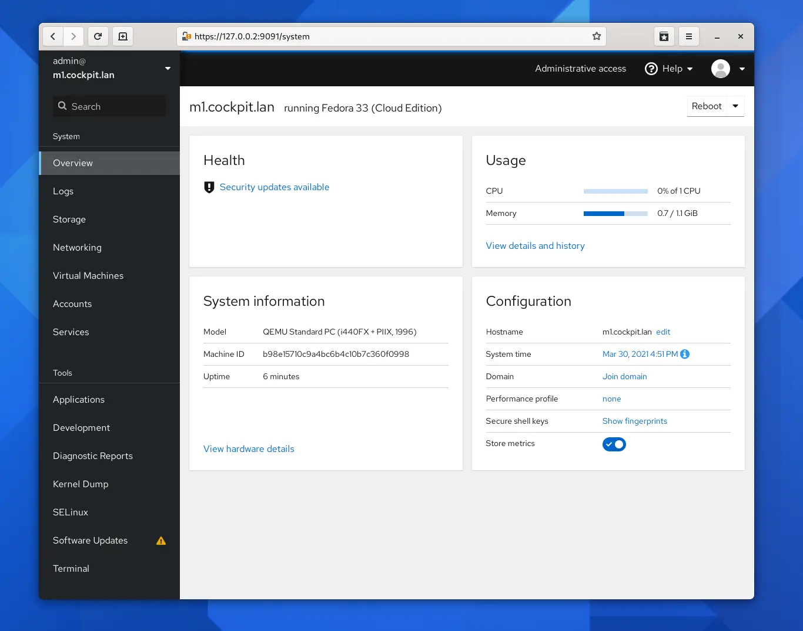

# TP: IHM Cockpit

---

## Objectifs pédagogiques 
- Installer KVM et ses IHM

--- 

## Cockpit



**Cockpit est un outil d'administration de serveur parrainé par Red Hat, axé sur la fourniture d'une interface moderne et conviviale pour gérer et administrer des serveurs.** 

Il permet notamment d'instancier des machines virtuelles KVM via son interface web à condition qu'on installe le plugin adéquat.

--- 

## Installation de cockpit

Ce TP nécessite une machine avec un système Debian, car Cockpit ne fonctionne pas sur Alpine.

```shell

$ apt update
$ apt install -y cockpit cockpit-machines pwgen
```

--- 
## Exploration de l'interface

**Vous pouvez accéder à l'interface web de cockpit sur** 

```shell

> https://<nom de domaine de votre machine>:9090

```

**Utilisez votre compte utilisateur stagiaire:devopsXXX**

Quels sont vos droits ? 

---

## Sécurisation du compte root

**Pour accéder rapidement au maximum de fonctionnalités, on va se logger en root sur Cockpit.**

```shell
$ PASS=$( pwgen -s 31 1 )
$ echo "Votre mot de passe root sécurisé : ${PASS}"

# Saisir le mot de passe sécurisé
$ passwd root

```

Utilisez ce compte pour vous logger dans Cockpit.

Comment marche l'authentification / Autorisation de cockpit ? Pourquoi ? 

---

## Explorer la partie Machines Virtuelles

**On va commencer par créer le stockage et le réseau nécessaires** 

Ce sont les deux premières contraintes opérationnelles de la virtualisation KVM. 

---

**Dans l'onglet Pools de stockage**

* En tant que root, créer un dossier de stockae 
```shell

$ mkdir /storage

```
* Création du pool de stockage

```shell

Nom : default
Type : Répertoire des systèmes de fichier
Chemin cible : /storage

```

* Activer le pool de stockage 

---

**Dans l'onglet Réseaux**

* S'assurer qu'un réseau de type bridge est bien disponible 

```shell

Mode de redirection : NAT 
DHCP : actif
```

Pouvez-vous décrire à quoi sert ce réseau virtuel ? 

Comment se manifeste-t-il sur l'hôte ? 

Indice : 

``` 

$ ip --brief --color link show
$ ip -br -c a 

```

---

## Créer une machine virtuelle 

**On revient dans la partie principale «Machines Virtuelles»**

* Créer une VM

```shell

    Nom: myVM
    Type d'installation : URL
    Source d'installation : https://dl-cdn.alpinelinux.org/alpine/v3.18/releases/x86_64/alpine-extended-3.18.0-x86_64.iso
    Système d'exploitation: Alpine 
    

```

Pour la liste des images à télécharger: 

> https://alpinelinux.org/downloads/

--- 

## Explorer la VM

**La VM est créée immédiatement et elle dispose d'une page web dédiée.**

On y accède en cliquant sur le nom de la machine. 

On voit des informations générales sur les consommations de la machine.

-- 

**De plus on accède à un écran virtuel dans la partie Console.**

On peut choisir une console série ou VNC. 

Pour VNC, il est conseillé d'agrandir la fenêtre avec le bouton `[Agrandir]`.

Dans les deux cas, l'utilisateur à utiliser est root sans mot de passe.

--- 

## État du système 

**Essayez de configurer le système avec la documentation Alpine du TP Proxmox.**

Qu'est-ce qui fonctionne ? Ou pas ? 

Indice : 

``` 

$ mount 
$ ping 1.1.1.1

```

---
