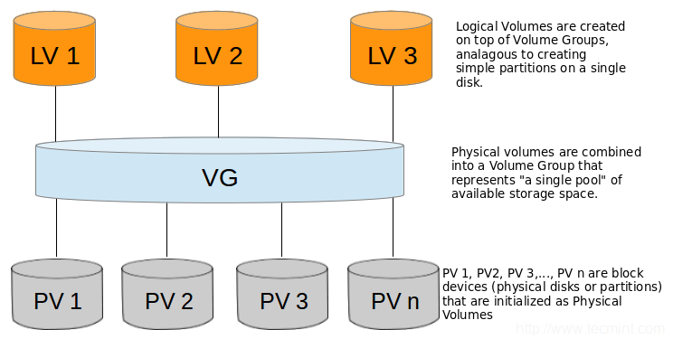

# TP: LVM 

## Objectifs pédagogiques

**Pratiques**

- Installer KVM et ses IHM
- Opérer des instances KVM via ses IHM
  - Maîtriser le stockage (pool, volume, chiffrement, virtfs)

**Stratégiques**

- Savoir choisir KVM comme outil d'architecture en fonction de critères rationnels.



## LVM : Logical Volume Manager

**Une partition statique ne peut être que sur un disque. En utilisant LVM les disques physiques deviennent transparents et ainsi une partition, dite partition LVM, peut être sur plusieurs disques. Les disques physiques sont définis en tant que volumes physiques (les PV) puis ils sont regroupés en groupes de volumes (les VG) et enfin découpés en volumes logiques (les LV). C’est sur les volumes logiques que sont implantés les systèmes de fichiers Linux.**

L’intérêt de LVM est de pouvoir agrandir ou diminuer dynamiquement une partition sans perte de données. Pour la gestion des disques des VM, utiliser un LV comme support permet donc d’accroître la capacité du disque dynamiquement et sans perte.

Ci-après un exemple de gestion LVM. Dans un premier temps, deux disques de 100 Go sont transformés en volume physique. Puis ils sont intégrés dans un groupe de volumes qui est ensuite découpé en volumes logiques. On remarque aussi qu’il est ainsi possible d’avoir un système de fichiers plus important que la capacité d’un disque.

Ci-dessous le principe d’agrandissement du LV initial de 130 Go à 250 Go. Il faut dans un premier temps ajouter un nouveau disque dans le VG faisant ainsipasser la capacité globale de 200 Go à 300 Go. Ensuite, il faut agrandir le LV et retailler le système de fichiers.

### Configuration LVM


Il est possible que la gestion LVM ne soit pas installée sur le système. Pour cela,installez via yum le package lvm2.

```shell

$ apt -y install lvm2

```
     

Comme vu précédemment avec le RAID, les paragraphes suivants vont présenter un exemple de configuration LVM. Ici aussi les disques seront simulés par des fichiers. Dans un premier temps, créer un répertoire ainsi que les fichierssimulant les disques. Dans l’exemple des disques de 100 Mo seront utilisés.

    
```shell
$ mkdir -p /home/disks
$ dd if=/dev/zero of=/home/disks/disk01 bs=1M count=100 
$ dd if=/dev/zero of=/home/disks/disk02 bs=1M count=100
$ dd if=/dev/zero of=/home/disks/disk03 bs=1M count=100
  ```
   

Procédez ensuite à la création des périphériques en loopback :

    
```shell
$ losetup -f /home/disks/disk01 
$ losetup -f /home/disks/disk02 
$ losetup -f /home/disks/disk03
$ losetup -a 
$ /dev/loop{x}: [0803]:9832539 (/home/disks/disk01)
$ /dev/loop{y}: [0803]:9832540 (/home/disks/disk02)
$ /dev/loop{z}: [0803]:9832544 (/home/disks/disk03)
```


La commande losetup -a peut renvoyer des devices différents si d’autres devices ont été définis de cette manière au préalable. La commande `losetup -d <device>` permet de libérer un device de type loop. À ce stade la machine dispose donc de trois disques supplémentaires, ces disques vont donc être préparéspour LVM en les définissant comme des volumes physiques (PV).

---

### Création des PV


La commande permettant ceci est pvcreate. Cette commande est destructive, les données du disque seront donc perdues.

    
```shell
$ pvcreate /dev/loop{x}
$ Physical volume "/dev/loop{X}" successfully created
$ pvcreate /dev/loop{y}
$ Physical volume "/dev/loop{X}" successfully created
$ pvcreate /dev/loop{z}
$ Physical volume "/dev/loop{X}" successfully created
     
```

Via la commande pvdisplay, il est possible d’obtenir des informations sur un volume physique.

    
```shell
$ pvdisplay 
```

Pour l’instant les PV ne sont pas affectés et donc inutilisables. Il faut maintenant les intégrer dans un groupe de volumes (VG).

### Création du VG


**Un VG porte un nom, il est courant de nommer les VG vg01, vg02... mais ceci n’est pas obligatoire.**

 La commande vgcreate est utilisée et outre le nom du VG, il faut spécifier le ou les PV qui seront intégrés au VG. Dans un premier temps, seuls les deux premiers PV seront intégrés au VG.
    
```shell
$ vgcreate vg01 /dev/loop{x} /dev/loop{y}
     
```

--- 

**La commande vgdisplay permet d’obtenir des informations sur le VG :**

    
```shell
$ vgdisplay vg01
     
```

---

**La commande montre que le VG dispose de deux PV.**

Par défaut LVM découpe les PV en Physical Extent d’une taille de 4Mo (PE size). 

La capacité utile est donc un multiple de 4Ko soit 48 \* 4Mo = 192 Mo. 

La commande pvdisplay sur /dev/loop0 ou /dev/loop1 montre l’affectation au vg01 :
    
```shell

$ pvdisplay /dev/loop0
     
```

--- 


### Création des LV

**La dernière étape consiste à créer le volume logique (LV).** 

Dans le cas des VM, c’est ce LV qui servira de disque dur.

La commande est `lvcreate`, celle-ci demande plusieurs options :

*   \-n: indique le nom du LV.
    
*   \-L: donne la dimension du LV en o, Ko, Mo…

La dernière option est le nom du VG dans lequel le LV sera créé.

--- 

**L’exemple suivant montre la création d’un LV nommé lvol1 d’une taille de 130Mo à l’intérieur de vg01.**

    
```shell
$ lvcreate -n lvol1 -L 130M vg01
Rounding up size to full physical extent 132,00 MiB
Logical volume "lvol1" created
     
```
---
**Cette commande va créer un périphérique sous la forme /dev/vg01/lvol1.** 

Via la commande lvdisplay il est possible de visualiser les informations du LV. 

On remarque que les 130 Mo ont été arrondis au PE supérieur soit 132 Mo.

```shell
    
$ lvdisplay

```
---

**Arrivé à ce stade, si on souhaite utiliser le LV comme système de fichiers il faut le formater et ensuite le monter classiquement.** 

Dans le cas d’un disque de VM, ce formatage n’est pas nécessaire. 

Pour poursuivre l’exemple, le LV sera formaté et ensuite la méthode d’agrandissement sera présentée.
    
```shell
$ mkfs -t ext4 /dev/vg01/lvol1
$ mkdir /u02
$ mount /dev/vg01/lvol1 /u02
$ df -h
...
/dev/mapper/vg01-lvol1  108M   24K   99M   1% /u02
```
---

**Le montage /u02 est exploitable comme n’importe quel système de fichiers traditionnel.** 

Pour la suite ce système de fichiers sera agrandi à une taille de 250Mo. Pour cela, il faut:

*   agrandir le VG ;
    
*   agrandir le LV ;
    
*   retailler le système de fichiers.
    

Ces actions se font à chaud et sans démonter le système de fichiers.

---

### Agrandissement du système de fichiers


Dans un premier temps, ajoutez le dernier PV (/dev/loop2) au VG. Cette actionfera passer la dimension de vg01 de 200 Mo à 300 Mo.

    
```shell
$ vgextend vg01 /dev/loop{z}
$ vgdisplay vg01
```

**Le nombre de disques est passé à 3 et la capacité à 288 Mo.**

---
    
**La seconde phase consiste à augmenter le LV de 120 Mo.**

```shell
$ lvextend -L +120M /dev/vg01/lvol1
     
```

Attention, ceci n’a en rien redimensionné le système de fichiers. Comme le montre la commande df, celui-ci reste sur sa taille initiale.

---
    
```shell
$ df -h
...
/dev/mapper/vg01-lvol1  108M   24K   99M   1% /u02
     
```

---

**Il faut retailler le système de fichiers avec la commande resize2fs :**

    
```shell
$ resize2fs -f -p /dev/vg01/lvol1
     
```

**Comme le montre la commande df, le système de fichiers est maintenant augmenté.**

    
```shell
$ df -h
...
/dev/mapper/vg01-lvol1  228M   24K  219M   1% /u02

     
```

---

## Cet exemple a simplement présenté la philosophie LVM. 

Il est important de rappeler que le LV ne doit pas être formaté en cas d’utilisation comme disque de VM. 

Utiliser un LV comme disque permet donc de faire évoluer sa dimension de manière dynamique.

Pour supprimer le LV

```shell

$ umount /u02
$ lvremove /dev/vg01/lvol1

```

---

## Utiliser LVM comme pool de stockage 

**Dans virt-manager, vous pouvez désormais créer pour l'hôte un pool de stockage de type LVM.**

Nommez votre pool "guest_images_lvm" par exemple

--- 

## Créer un nouveau volume 

**Vous pouvez choisir de créer un nouveau volume dans virt-manager au moment de la création d'une machine**

Ou également utiliser virsh.

```shell

$ virsh vol-create-as guest-images-lvm volume1 300M
$ virsh vol-list guest-images-lvm

```

