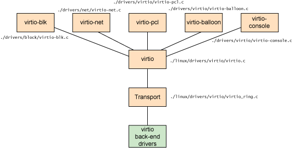

# 2.4 L'interface Virtio

## Objectifs pédagogiques

**Théoriques**

- Connaître les spécificités de la virtualisation KVM

**Stratégiques**

- Savoir choisir KVM comme outil d'architecture en fonction de critères rationnels.

---

##  VIRTIO est une abréviation pour Virtual Input-Output (Entrées-Sorties Virtuelles)

**Virtio est une interface de programmation du Noyau Linux utile aux machines virtuelles.**

En un mot, virtio est une couche d'abstraction sur les appareils dans un hyperviseur paravirtualisé. 

---

## Virtualisation complète vs paravirtualisation

Commençons par une présentation rapide de deux types distincts de schémas de virtualisation : la virtualisation complète et la paravirtualisation. 

---

**Dans une _virtualisation complète_, le système d'exploitation invité s'exécute au-dessus d'un hyperviseur qui repose sur le bare metal.** 

L'invité ne sait pas qu'il est virtualisé et ne nécessite aucune modification pour fonctionner dans cette configuration. 

**Inversement, dans la _paravirtualisation_, le système d'exploitation invité est non seulement conscient qu'il s'exécute sur un hyperviseur, mais inclut également du code pour rendre les transitions invité-hyperviseur plus efficaces.**

---

**Dans le schéma de _virtualisation complète_, l'hyperviseur doit émuler le matériel du périphérique, qui émule au niveau le plus bas de la conversation (par exemple, vers un pilote réseau).** 

Bien que l'émulation soit propre à cette abstraction, c'est aussi la plus inefficace et la plus compliquée. 

---

**Dans le schéma de _paravirtualisation_, l'invité et l'hyperviseur peuvent travailler en coopération pour rendre cette émulation efficace.** 

L'inconvénient de l'approche de paravirtualisation est que le système d'exploitation est conscient qu'il est virtualisé et nécessite des modifications pour fonctionner.

---
---
**Le côté droit de l'image de départ montre le cas de la paravirtualisation.** 

Ici, le système d'exploitation invité est conscient qu'il s'exécute sur un hyperviseur et inclut des pilotes qui agissent comme frontal. 

L'hyperviseur implémente les pilotes principaux pour l'émulation de périphérique particulière. 

**Ces pilotes front-end et back-end sont là où virtio entre en jeu, fournissant une interface standardisée pour le développement d'un accès aux appareils émulés afin de propager la réutilisation du code et d'augmenter l'efficacité.**

---

## Une abstraction pour les invités Linux

**Virtio est une abstraction pour un ensemble d'appareils émulés courants dans un hyperviseur paravirtualisé.** 

Cette conception permet à l'hyperviseur d'exporter un ensemble commun d'appareils émulés et de les rendre disponibles via une interface de programmation d'application (API) commune. 

Les pilotes principaux n'ont pas besoin d'être communs tant qu'ils implémentent les comportements requis du frontal.

--- 

**Généralement, l'émulation de périphérique se produit dans l'espace utilisateur à l'aide de QEMU, de sorte que les pilotes principaux communiquent dans l'espace utilisateur de l'hyperviseur pour faciliter les E/S via QEMU.** 

QEMU est un émulateur système qui, en plus de fournir une plate-forme de virtualisation du système d'exploitation invité, fournit l'émulation d'un système entier (contrôleur hôte PCI, disque, réseau, matériel vidéo, contrôleur USB et autres éléments matériels).

L'API virtio s'appuie sur une simple abstraction de tampon pour encapsuler les besoins en commandes et en données de l'invité. 

---

## Architecture des drivers virtio

---
## Scheduling dans virtio

---

## Stalbilité et performances

**Virtio offre une base de code plus simple pour les pilotes paravirtualisés et une émulation plus rapide des périphériques virtuels.**

Mais plus important encore, virtio s'est avéré fournir de meilleures performances (2 à 3 fois pour les E/S réseau) que les solutions commerciales actuelles. 

**virtio a été utilisé dans la recherche sur le calcul haute performance (HPC) pour développer des communications inter-machines virtuelles (VM) via le passage de mémoire partagée.** 

---