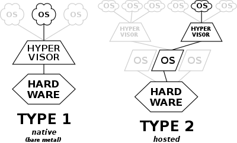
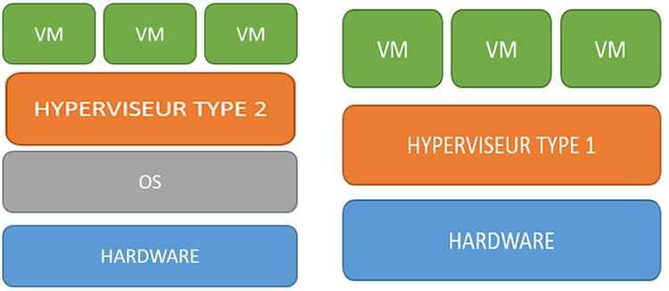
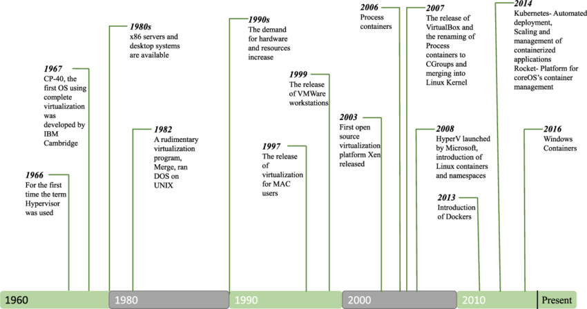
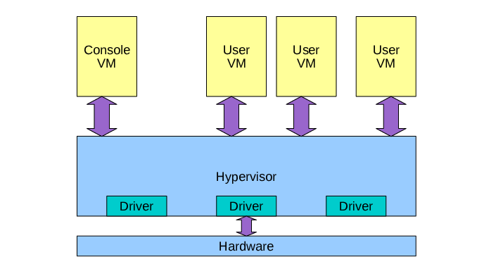
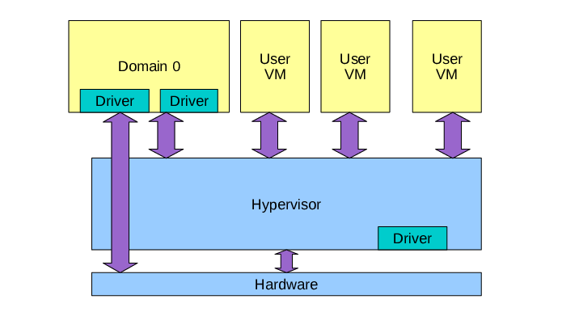
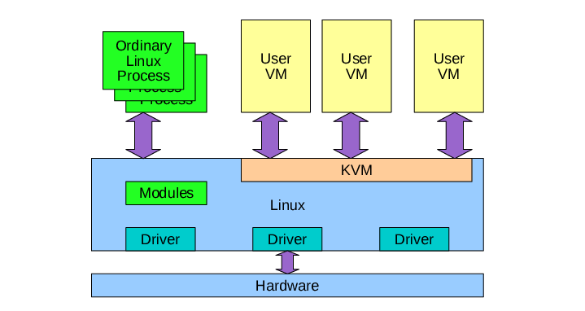

# Théorie : La virtualisation

## Objectifs pédagogiques

**Théoriques**

- Connaître les spécificités de la virtualisation KVM




---

## Définitions 

**On va clarifier immédiatement certains termes essentiels pour la formation.**

---

### Hyperviseurs

> Un hyperviseur est une plate-forme de virtualisation qui permet à plusieurs systèmes d’exploitation de fonctionner en parallèle dans une seule machine physique.

---

### Systèmes d’exploitation

> Un système d'exploitation (souvent appelé OS — de l'anglais _operating system_) est un ensemble de programmes qui dirige l'utilisation des ressources d'un ordinateur par des logiciels applicatifs.

On désigne aussi bien le code (la distribution) que l'instance active qui utilise ce code.  

---

### Machine virtuelles

> Une machine virtuelle (anglais _virtual machine_, abr. VM) est une illusion d'un appareil informatique créée par un logiciel d'émulation ou instanciée sur un hyperviseur. 
  
Le logiciel d'émulation simule la présence de ressources matérielles et logicielles telles que la mémoire, le processeur, le disque dur, voire le système d'exploitation et les pilotes, permettant d'exécuter des programmes dans les mêmes conditions que celles de la machine simulée.

---

### Conteneurs 

> Un conteneur est un ensemble de processus isoles au sein d'un système d'exploitation parent. 
 
L'isolation des processus est faite sur un noyau commun. 

---

### Noyau

> Un noyau de système d’exploitation, _kernel_ en anglais1, est une des parties fondamentales de certains systèmes d’exploitation qui gère les ressources de l’ordinateur et permet aux différents composants — matériels et logiciels — de communiquer entre eux.

L'usage d'un noyau différent pour chaque machine virtuelle distingue la virtualisation de l'isolation par conteneurs, à noyau unique.

--- 

### Paravirtualisation

>  La paravirtualisation est une technique de virtualisation qui présente une interface logicielle similaire à du matériel réel à une machine virtuelle mais optimisée pour ce type de fonctionnement, contrairement à l'émulation d'un périphérique matériel existant qui peut s'avérer laborieuse et surtout lente.

---

### Virtualisation matérielle

> La virtualisation matérielle est une technique d'optimisation des performances pour la virtualisation, qui consiste à utiliser les propriétés de virtualisation du processeur. 

Le support de la virtualisation peut être intégré au processeur ou assisté par celui-ci, le matériel se chargeant, par exemple, de virtualiser les accès mémoire ou de protéger le processeur physique des accès les plus bas niveaux. Cela permet de simplifier la virtualisation logicielle et de réduire la dégradation de performances.


 
---

## Les différentes techniques de virtualisation

---

### Virtualisation de serveurs : native vs hosted


@ blog.nexthope

---

### Hyperviseurs "bare metal"

**Les hyperviseurs « bare-metal » ou de type 1 interagissent avec les ressources physiques sous-jacentes, remplaçant complètement le système d'exploitation traditionnel.** 

C'est un peu la solution historique de virtualisation, pour fournir des solution dédiées uniquement à la virtualisation.

Exemple de solutions 

* VMWARE / ESXi
* Hyper-V

--- 

**Les hyperviseurs de type 2 s'exécutent comme une application sur un système d'exploitation existant.** 

L’hyperviseur de type 2, ou «host metal» fonctionne à l’intérieur d’un autre système d’exploitation.

Exemple d’hyperviseur de type 2 : VirtualBox
* Oracle VirtualBox
* VMWare Workstation 

---

**KVM est une solution qui se situe entre type 1 et type 2.**

En effet, la frontière est plus floue dans la mesure où KVM lance des processus au sein d'un système hôte.

Dans les faits, les type 1 sont désormais associés aux systèmes qui lancent des services persistants sur des serveurs, et le type 2 des solutions pour postes desktop. 

--- 

### Aperçu historique 



- 1960 Émergence de la virtualisation sur mainframes (IBM : labos de recherche)
- 1970 Usage de a virtualisation pour les mainframes CP/CMS (IBM : grands comptes) 
- 1980 Émergence de la virtualisation sur systèmes UNIX  
- 1985 Processeurs Intel 386 avec virtualisation 8086 (16 bit)
- 1990 Usage de la  virtualisation sur systèmes UNIX
- 2000 Émergence de la virtualisation sur systèmes Windows
- 2005 Usage de la  virtualisation sur systèmes Windows
- 2006 Processeurs Intel et AMD x86 avec virtualisation 
- 2010 Usage généralisé de la virtualisation
- 2015 Émergence de la conteneurisation Docker
- 2020 Usage de la conteneurisation Docker

---

## Quelques solutions propriétaires et libres

### VMware / ESX.




* solution historique, reconnue 
* Non libre, solution avec du support payant
* coûteux (~$1400 / CPU / an)
* bonne interface graphique

---

### Xen (Linux)



* Solution reconnue
* Solution libre (Rappel des 4 libertés !)
* IHM conviviales disponibles ex: https://xcp-ng.org/
---
**Xen utilise un `Dom0` pour piloter les machines virtuelles, qui est un serveur virtualisé avec des droits plus importants.**

* Dom0, ou privilégié, c’est-à-dire l’OS de l’hôte.
* DomU, les invités, c’est-à-dire les VM.


---

###  KVM (Linux)



*  Solution Libre 
* IHM ligne de commande et autres de virt-manager à Proxmox

**La virtualisation KVM, libre, open source et officiellement incluse dans le noyau Linux est une alternative tout à fait crédible à une solution propriétaire.**

• Principe et architecture : module intégré dans le
noyau Linux, base QEMU

• Prérequis matériels et logiciels

---
# KVM (Kernel-based Virtual Machine) et QEMU (Quick Emulator)

## KVM 

**KVM est intégré au sein du noyau Linux depuis la version 2.6.20.**

KVM a été conçu à partir d’un embranchement de QEMU puis celui-ci a à son tour intégré le code source de l’autre de sorte que les deux sont interdépendants. 

--- 

**La principale modification apportée est la prise en charge du module kvm.**

Lorsqu'on parle de KVM, on parle généralement de l'ensemble : la version modifiée de QEMU et le module kvm.

--- 

**QEMU est capable, grâce à son module KQEMU (K pour Kernel, « noyau » en anglais), d'exécuter du code machine directement sur le processeur hôte afin d'accélérer l'émulation.**

Les technologies mises en place par les deux principaux fondeurs que sont AMD et Intel étant différentes, le module kvm se décline en deux sous-modules : kvm-intel et kvm-amd ; le module kvm n'est finalement présent que pour fournir à l'émulateur une abstraction supplémentaire.

---

**Dans les versions récentes de kvm (au minimum la version 608) il est possible d'utiliser un mécanisme similaire à la paravirtualisation en utilisant virtio.**

Les pilotes virtio sont inclus dans le noyau Linux de version 2.6.25 au minimum.

Il existe aussi des pilotes virtio pour Windows9.

Ce mécanisme permet une vitesse d'exécution accrue car il n'est plus nécessaire d'émuler des périphériques matériels.

---

### Intégration dans le noyau Linux de KVM  

**Elle est opérérée par des trois modules noyaux.** 

* kvm 
* kvm_intel
* kvm_amd

---

**Concrètement, KVM est intégré au noyau Linux automatiquement.**

Ce sont les autres outils qui doivent être intégrés via des packages.

```shell

# Exemple de packages dans Debian 
$ apt list | grep qemu


```

--- 

Les outils de pilotage de KVM sont en "`user land`" et les opérations de virtualisation sont effectuées par le noyau.

--- 

## QEMU

**QEMU est un puissant émulateur, capable de simuler une grande variété de processeurs.**

QEMU est utilisé aussi bien par Xen que par KVM afin de fournir de la paravirtualisation aux OS virtualisés.

--- 

**QEMU peut donc fonctionner sans KVM.**

L'apport de KVM à QEMU est une accélération des appels système et un accès à l'accélération matérielle des processeurs.

--- 

**Pour avoir une idée de la quantité de processeurs que peut émuler QEMU et du support intégré de KVM et Xen.**

```shell

$ man qemu
...
        ...
       The QEMU PC System emulator simulates the following peripherals:
       • i440FX host PCI bridge and PIIX3 PCI to ISA bridge
       • Cirrus CLGD 5446 PCI VGA card or dummy VGA card with Bochs VESA extensions (hardware level, including all non standard modes).
       • PS/2 mouse and keyboard
       • 2 PCI IDE interfaces with hard disk and CD-ROM support
       • Floppy disk
       • PCI and ISA network adapters
       • Serial ports
       ...
       -enable-kvm
              Enable KVM full virtualization support. This option is only available if KVM support is enabled when compiling.

       -xen-domid id
              Specify xen guest domain id (XEN only).
       ...

```