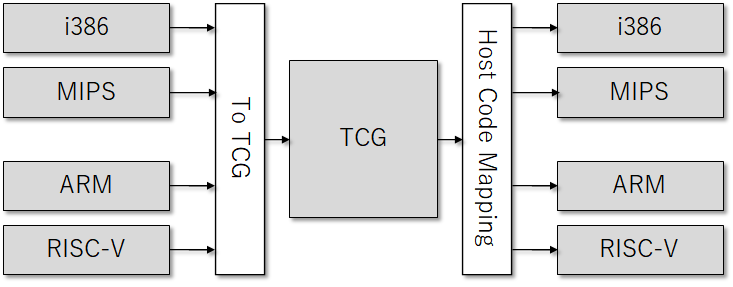
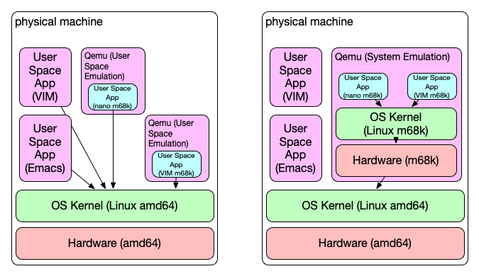

# Theorie : QEMU

## Objectifs pédagogiques

**Théoriques**

- Connaître les spécificités de la virtualisation KVM
- Connaître les IHM permettant de piloter KVM

---

**QEMU est un émulateur et virtualiseur de machine et d'espace utilisateur générique et open source.**

QEMU est capable d'émuler une machine complète dans un logiciel sans avoir besoin de prise en charge de la virtualisation matérielle.

**En utilisant la traduction dynamique, il atteint de très bonnes performances.**

---

**QEMU peut également s'intégrer aux hyperviseurs Xen et KVM pour fournir du matériel émulé tout en permettant à l'hyperviseur de gérer le CPU.**

Avec la prise en charge de l'hyperviseur, QEMU peut atteindre des performances quasi natives pour les processeurs.

Lorsque QEMU émule directement les processeurs, il est capable d'exécuter des systèmes d'exploitation conçus pour une machine (par exemple, une carte ARMv7) sur une autre machine (par exemple, une carte PC x86_64).

---

**QEMU est également capable de fournir une virtualisation d'API d'espace utilisateur pour les interfaces de noyau Linux et BSD.**

Cela permet aux binaires compilés avec une architecture ABI (par exemple, l'ABI Linux PPC64) d'être exécutés sur un hôte utilisant une architecture ABI différente (par exemple, l'ABI Linux x86_64).

Cela n'implique aucune émulation matérielle, simplement une émulation CPU et syscall.

---

**QEMU vise à s'adapter à une variété de cas d'utilisation.**

Il peut être invoqué directement par les utilisateurs souhaitant avoir un contrôle total sur son comportement et ses paramètres.

Il vise également à faciliter l'intégration dans les couches de gestion de niveau supérieur, en fournissant une interface de ligne de commande stable et une API de surveillance.

Il est généralement invoqué indirectement via la bibliothèque libvirt lors de l'utilisation d'applications open source telles que oVirt, OpenStack et virt-manager.
