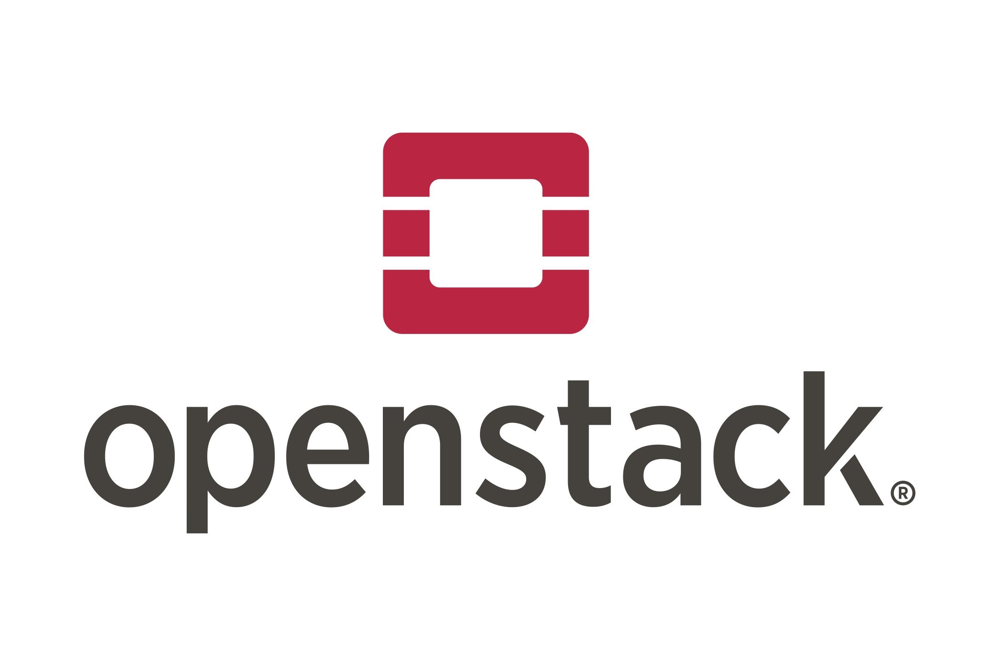
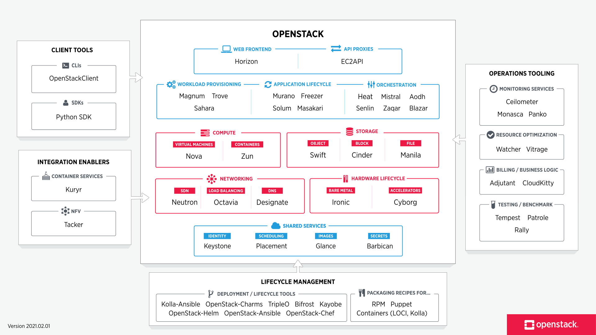

# Théorie: Les IHM KVM

## Objectifs pédagogiques

**Théoriques**

- Connaître les spécificités de la virtualisation KVM
- Connaître les IHM permettant de piloter KVM


Stratégiques

- Savoir choisir KVM comme outil d'architecture en fonction de critères rationnels.

---

**Il y a de nombreuses solutions permettant de piloter QEMU-KVM.**

On va identifier celles qui sont aujourd'hui parmi les plus pertinentes dans le monde du logiciel libre.


## Documentation 

- https://www.linux-kvm.org/page/Management_Tools

---


## L’API libvirt


**libvirt est une bibliothèque, une API, un daemon et des outils en logiciel libre de gestion de la virtualisation.**

Elle est notamment utilisée par :


- KVM/QEMU 
- Xen 
- VMware ESX 
- LXC – système léger de conteneur Linux

Documentation : 

* http://www.libvirt.org

---

**Écrite en langage C, libvirt dispose d'intégration pour différents langages dont**

- Python 
- Java
- Ruby
- Go
- PHP
- ...

---

**L’API libvirt, dont le site officiel est accessible à l’adresse , met à disposition un grand nombre d’utilitaires comme virt-manager, virt-install, virt-viewer et surtout un shell interactif dédié à la gestion des machines virtuelles : virsh.**

L’API libvirt se connecte à l’hyperviseur local et peut ainsi être utilisée soit en local, soit à distance via SSH.

L’API libvirt se place donc comme une interface entre le ou les hyperviseurs et le matériel.

```
virt-admin                 daemon administration interface
virt-alignment-scan        Check alignment of virtual machine partitions
virt-builder               Build virtual machine images quickly
virt-builder-repository    Build virt-builder source repository easily
virt-cat                   Display files in a virtual machine
virt-clone                 clone existing virtual machine images
virt-copy-in               Copy files and directories into a virtual machine disk image.
virt-copy-out              Copy files and directories out of a virtual machine disk image.
virt-customize             Customize a virtual machine
virt-df                    Display free space on virtual filesystems
virt-dib                   Run diskimage-builder elements
virt-diff                  Differences between files in two virtual machines
virt-edit                  Edit a file in a virtual machine
virt-filesystems           List filesystems, partitions, block devices, LVM in a virtual machine or disk image
virt-format                Erase and make a blank disk
virt-get-kernel            Extract kernel and ramdisk from guests
virt-host-validate         validate host virtualization setup
virt-index-validate        Validate virt-builder index file
virt-inspector             Display operating system version and other information about a virtual machine
virt-install               provision new virtual machines
virt-list-filesystems      List filesystems in a virtual machine or disk image
virt-list-partitions       List partitions in a virtual machine or disk image
virt-log                   Display log files from a virtual machine
virt-ls                    List files in a virtual machine
virt-make-fs               Make a filesystem from a tar archive or files
virt-manager               Graphical tool for managing libvirt VMs
virt-p2v-make-disk         Build the virt-p2v disk using virt-builder
virt-p2v-make-kickstart    Build the virt-p2v kickstart
virt-p2v-make-kiwi         Build the virt-p2v kiwi configuration
virt-pki-validate          validate libvirt PKI files are configured correctly
virt-qemu-run              Run a standalone QEMU guest
virt-rescue                Run a rescue shell on a virtual machine
virt-resize                Resize a virtual machine disk
virt-sparsify              Make a virtual machine disk sparse
virt-sysprep               Reset, unconfigure or customize a virtual machine so clones can be made
virt-tail                  Follow (tail) files in a virtual machine
virt-tar                   Extract or upload files to a virtual machine
virt-tar-in                Unpack a tarball into a virtual machine disk image.
virt-tar-out               Pack a virtual machine disk image directory into a tarball.
virt-viewer                display the graphical console for a virtual machine
virt-win-reg               Export and merge Windows Registry entries from a Windows guest
virt-xml                   Edit libvirt XML using command line options.
virt-xml-validate          validate libvirt XML files against a schema
```
---

## Cockpit 


**Cockpit est projet sponsorisé par RedHat.**

Cockpit est un gestionnaire de serveur qui facilite l’administration de vos serveurs Linux via un navigateur Web. 

---

**Cockpit est parfait pour les nouveaux administrateurs système, leur permettant d’effectuer facilement des tâches simples telles que l’administration du stockage, l’inspection des journaux, le démarrage et l’arrêt des services.** 

Vous pouvez surveiller et administrer plusieurs serveurs en même temps. Il suffit de les ajouter en un seul clic et vos machines s’occuperont de leurs pairs.

---

**Sauter entre le terminal et l’outil web n’est pas un problème, car un service démarré via Cockpit peut être arrêté via le terminal.** 

De même, si une erreur se produit dans le terminal, elle s’affiche dans l’interface du journal Cockpit.

---

**Le plugin Machines Virtuelles de Cockpit lui permet de piloter QEMU/KVM via l'api Libvirt.**

De la sorte, toutes les opérations menées via Cockpit sont visualisables dans les autres outils associés à libvirt.

---


## Proxmox


**La plateforme de gestion de virtualisation open-source Proxmox Virtual Environment est éditée par la société Proxmox Server Solutions GmbH fondée en 2005.** 

PVE intègre étroitement l'hyperviseur KVM et les conteneurs Linux (LXC), les fonctionnalités de stockage et de mise en réseau définies par logiciel, sur une plate-forme unique. 

Grâce à l'interface utilisateur Web intégrée, vous pouvez facilement gérer les machines virtuelles et les conteneurs, la haute disponibilité des clusters ou les outils de reprise après sinistre intégrés.

---


**Proxmox VE inclut le support KVM depuis le début du projet.**

PVE propose une intégration profonde et efficace de KVM, qui peut être géré à travers :

* l'interface web
* des clients en ligne de commande 
* une API REST

---

**Proxmox inclut différentes fonctionnalités pour simplifier la gestion du service.**

Le fonctionnement natif en cluster simplifie la prise en charge de services distribués comme : 

- Implémentation efficace de CEPH
- Stockage réseaux classiques Gluster, iSCSI, etc.
- Migration à chaud en un clic 

---


## OpenStack 



**OpenStack est un ensemble de logiciels open source permettant de déployer des infrastructures de cloud computing (infrastructure en tant que service).** 

L'ambition d'OpenStack est de fournir un ensemble de services en Private Cloud, avec des interfaces :

* API First
* Ligne de commande 
* Web : Projet Horizon

---



**OpenStack possède une architecture modulaire composée de plusieurs projets corrélés (Nova, Swift, Glance...) qui permettent de contrôler les différentes ressources des machines virtuelles telles que la puissance de calcul, le stockage ou encore le réseau inhérent au centre de données sollicité.**

Le projet d'OpenStack est de concurrencer des solutions propriétaires comme AWS avec des API compatibles S3 et EC2.

Il est de fait opéré par des opérateurs nationaux (OVH), voire souverains (Numergy, China Telecom, Deutsche Telekom parmi d'autres)

Dans les faits OpenStack est une solution complexe à administrer, réservée à des infrastructures de grande taille.

---

